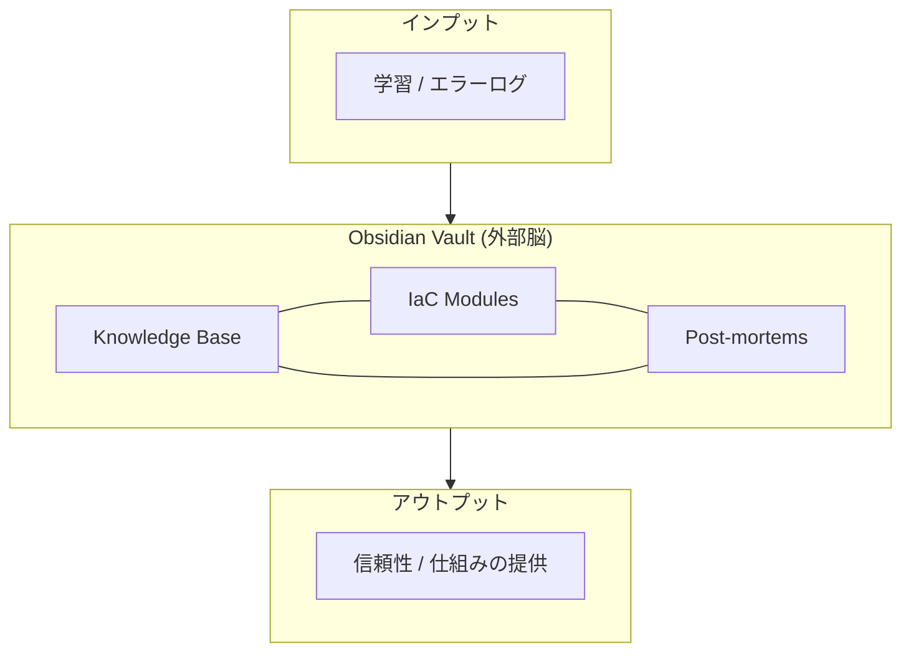

# 🎯 SRE 生存戦略：図解 (Mermaid)

## 📊 1. 技術選定マトリクス (希少性 x 汎用性)

33歳、未経験から最短で価値を出すためのポートフォリオ。

```mermaid
quadrantChart
    title 技術選定マトリクス
    x-axis 汎用性(低い) --> 汎用性(高い)
    y-axis 希少性(低い) --> 希少性(高い)
    quadrant-1 抽象化レイヤー (Terraform / K8s)
    quadrant-2 尖った技術 (eBPF / OTel)
    quadrant-3 クラウド特定機能 (依存のリスク)
    quadrant-4 枯れた技術 (Linux / Network)
    "Terraform": [0.8, 0.7]
    "Kubernetes": [0.9, 0.8]
    "Linux / NW": [0.95, 0.2]
    "eBPF": [0.4, 0.9]
    "OpenTelemetry": [0.6, 0.8]
    "GUI Operation": [0.2, 0.1]
```

---

## 🧠 2. Vault アーキテクチャ図 (外部脳)

「実務未経験」を「仕組み」で超えるためのシステム構成。


