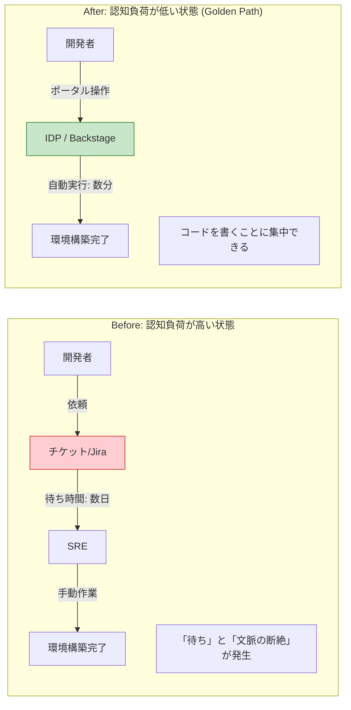
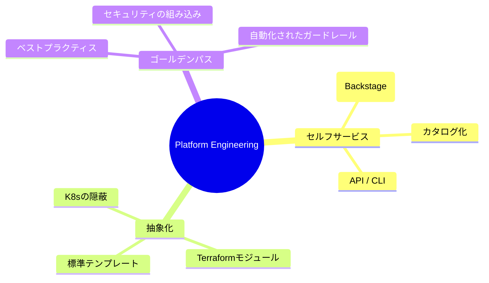
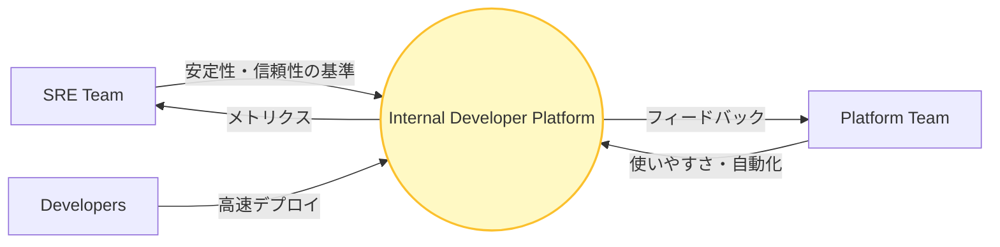

# 「SRE実践：Platform Engineering 入門」図解 (Mermaid)

このファイルは、YouTube 動画「【SRE実践 #7】Platform Engineering 入門」で使用された図解を Mermaid 形式で集約したものです。

## 1. SRE と Platform Engineering の違い
### 「魚を与える」か「釣り竿と池を整備する」か
```mermaid
graph TD
    subgraph "従来型 (SRE focus)"
        SRE_M[SRE Team] -->|1. 手動構築 / チケット対応| Cloud_M[Cloud Infrastructure]
        Dev_M[Product Developers] -->|2. 構築依頼 (Ticket)| SRE_M
    end
    
    subgraph "Platform Engineering (IDP focus)"
        PE_Team[Platform Team] -->|1. Build & Maintain| IDP[Internal Developer Platform / IDP]
        Dev_PE[Product Developers] -->|2. セルフサービス / 1-click| IDP
        IDP -->|3. 自動プロビジョニング| Cloud_PE[Cloud Infrastructure]
        SRE_PE[SRE Team] -->|4. ガードレール / ポリシー策定| IDP
    end
    
    style IDP fill:#f9f,stroke:#333,stroke-width:4px
    style SRE_PE fill:#e1f5fe,stroke:#01579b
    style PE_Team fill:#e8f5e9,stroke:#2e7d32
```

## 2. 開発者の認知負荷 (Cognitive Load) の削減
### Before (チケット駆動) vs After (セルフサービス)


## 3. Platform Engineering の 3 つの柱
### セルフサービス、抽象化、ゴールデンパス


## 4. SRE と Platform Team の協調関係
### 信頼性とスピードの両立


---
[SRE Roadmap Vault 2026 Home](../README.md)
