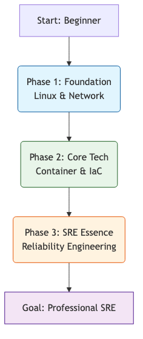
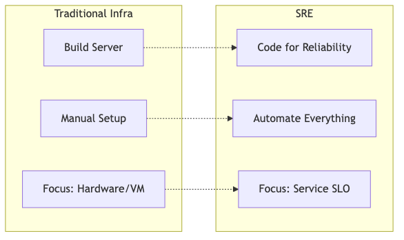
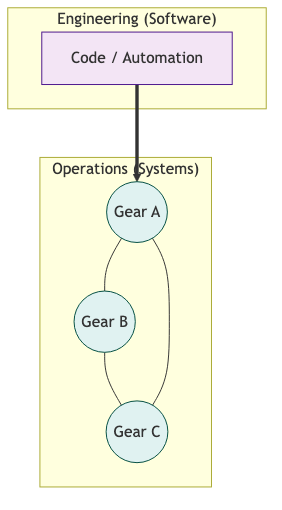
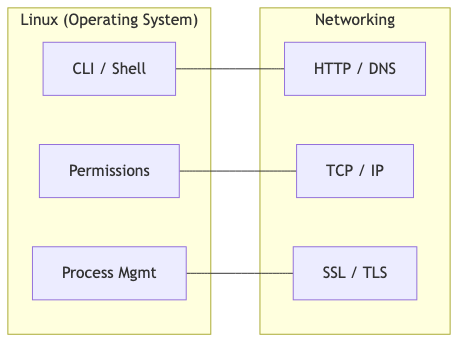
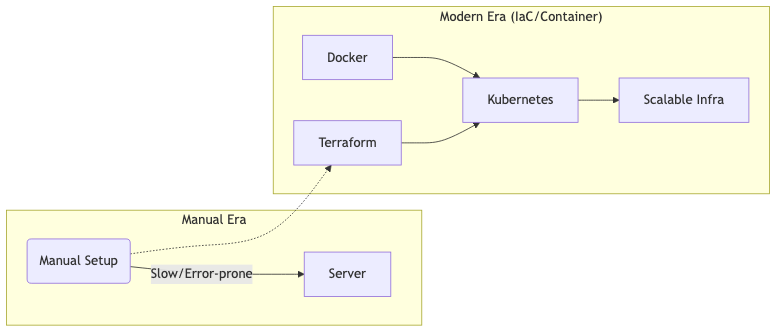
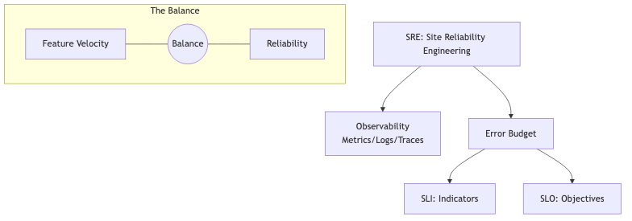
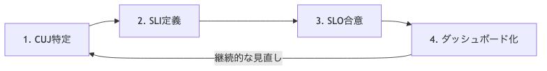
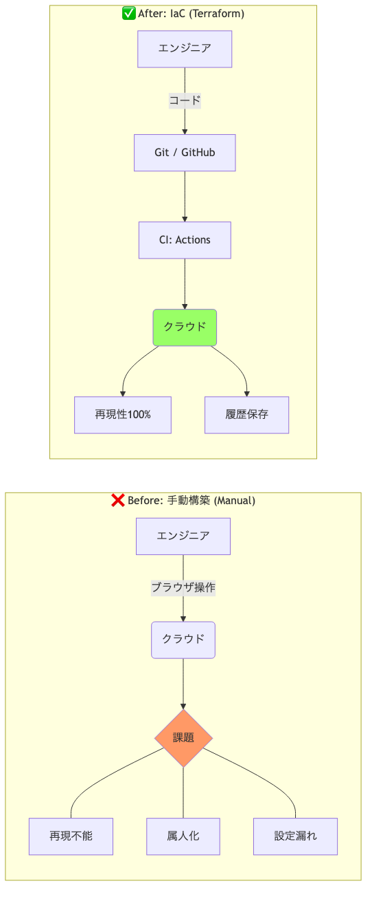
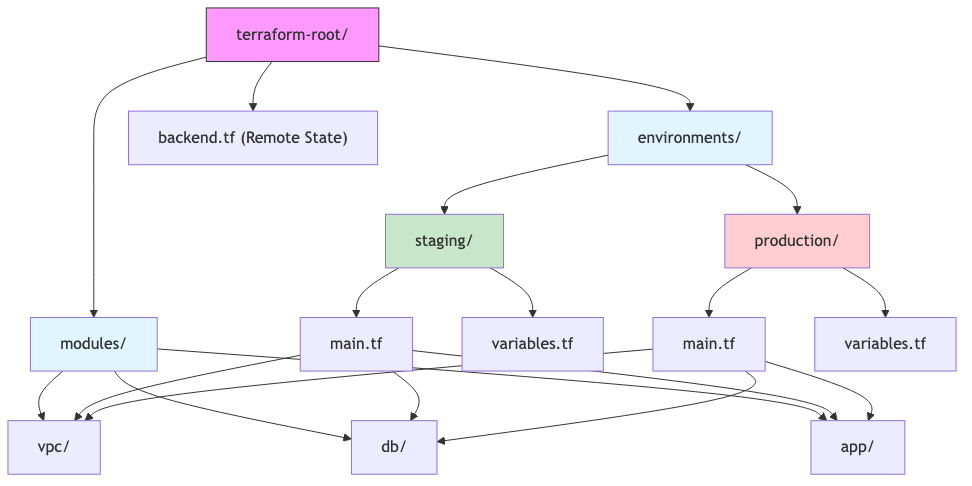
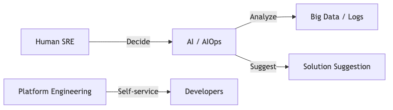

# 📊 SRE Roadmap: Diagrams (Mermaid & Images)

このディレクトリには、動画シリーズで使用したすべての図解が含まれています。
Mermaid 形式（編集用）と PNG 形式（閲覧用）の両方を用意しています。

## 🗺️ ロードマップ全体像 (Overall Roadmap)

### 2026年版 SRE 独学ロードマップ

- [Source (.mmd)](./01_Overall_Roadmap.mmd)

---

## 🧱 Phase 別の詳細図解

### 1. 土台：インフラの基礎とマインドセット

### 2. コア：SRE の中核技術

### 3. 本質：SRE の哲学と高度な自動化

---

## 🛠️ 技術別・トピック別図解

### SLI/SLO 設計の 4 ステップ

- [Source (.mmd)](./04_SLO_Design_Steps.mmd)

### IaC (Terraform) 入門：Before vs After

### Terraform 推奨ディレクトリ構成

### 2026年 SRE 最新トレンド

---
[SRE Roadmap Vault 2026 Home](../README.md)
